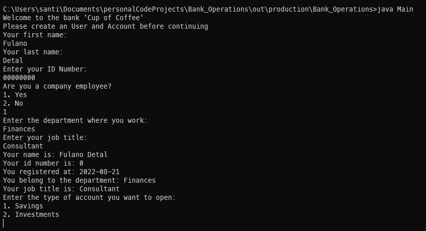

[![LinkedIn][linkedin-shield]][linkedin-url]


<h3 align="center">Bank Operations</h3>


<!-- ABOUT THE PROJECT -->
This is a program to test my knowledge of Object-Oriented Programming and Java, taken from a challenge I saw on a YouTube video.
<h4 align="center">UML Class Diagram:</h4>


### Built With
* [![Java][java-shield]][java-url]
* [![Intellij][intellij-shield]][intellij-url]


### Prerequisites

Java 8 and Git installed

### Installation

Clone this repository
```bash
git clone https://github.com/Santiagolp23/Bank_Operations
```

<!-- USAGE EXAMPLES -->
## Usage
Change the working directory to the production folder
```bash
cd ./out/production/Bank_Operations
```
Run Main class
```bash
Java Main
```
And follow the instructions given in the terminal :)



<!-- CONTACT -->
## Contact

Santiago Lopez - [Linkedin][linkedin-url] - santiagolopezpardo@gmail.com

Project Link: [https://github.com/Santiagolp23/Bank_Operations](https://github.com/Santiagolp23/Bank_Operations)

<!-- MARKDOWN LINKS & IMAGES -->
[linkedin-shield]: https://img.shields.io/badge/-LinkedIn-black.svg?style=for-the-badge&logo=linkedin&colorB=555
[linkedin-url]: https://www.linkedin.com/in/santiagolp2/
[intellij-shield]: https://img.shields.io/badge/IntelliJ_IDEA-000000.svg?style=for-the-badge&logo=intellij-idea&logoColor=white
[intellij-url]: https://www.jetbrains.com/idea/
[java-shield]: https://img.shields.io/badge/Java-ED8B00?style=for-the-badge&logo=java&logoColor=white
[java-url]: https://www.oracle.com/java/